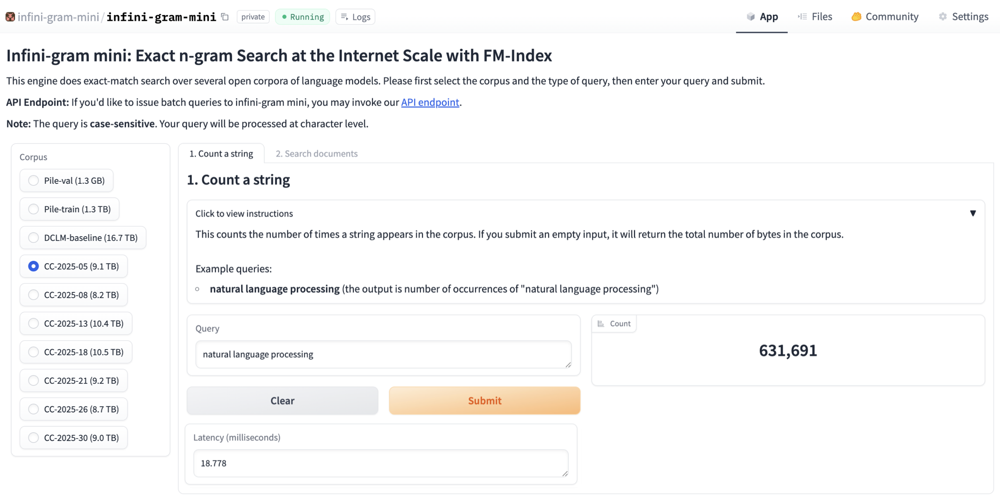
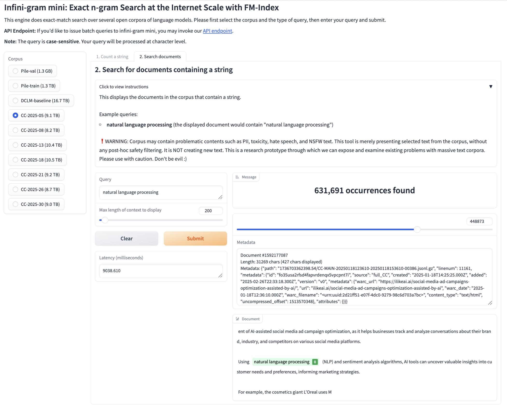

<h2 align="center">📖 <b>Infini-gram mini: Exact n-gram Search at the Internet Scale with FM-Index</b></h2>

<p align="center">Hao Xu<sup>1</sup>, <a href="https://liujch1998.github.io">Jiacheng Liu</a><sup>1,2</sup>, <a href="https://homes.cs.washington.edu/~yejin/">Yejin Choi</a><sup>3</sup>, <a href="https://nasmith.github.io/">Noah A. Smith</a><sup>1,2</sup>, <a href="https://homes.cs.washington.edu/~hannaneh/">Hannaneh Hajishirzi</a><sup>1,2</sup></p>

<p align="center"><sup>1</sup>University of Washington, <sup>2</sup>Allen Institute for AI, <sup>3</sup>Stanford University</p>

<p align="center">[<a href="https://huggingface.co/spaces/infini-gram-mini/infini-gram-mini">Web Interface</a>] [<a href="https://infini-gram-mini.readthedocs.io/en/latest/api.html">API Endpoint</a>]  [<a href="https://infini-gram-mini.readthedocs.io/en/latest/api.html">Docs</a>] [<a href="https://github.com/xuhaoxh/infini-gram-mini">Code</a>] [<a href="https://arxiv.org/abs/2506.12229">Paper</a>] [<a href="https://huggingface.co/spaces/infini-gram-mini/Benchmark-Contamination-Monitoring-System">Benchmark Contamination Bulletin</a>]</p>

---

<br/>

Curious about what’s inside Internet-scale corpora? You’re in the right place 🤩!

<!-- We constructed text indexes that is only **0.44x** their original size (7% of storage requirement of <a href="https://infini-gram.io/">infini-gram</a>).  -->
We make several open text corpora **searchable**: {[Common Crawl 2025 Janurary-March crawls](https://commoncrawl.org/), [DCLM-baseline](https://huggingface.co/datasets/mlfoundations/dclm-baseline-1.0), and [Pile](https://huggingface.co/datasets/EleutherAI/pile)}. In total, these encompass **45.6 TB** of text, which is the **largest body of searchable text** in the open-source community (as of May 2025).

**Infini-gram mini** is an efficient search engine designed to handle exact-match search on arbitrarily long queries across Internet-scale corpora with small storage overhead. The index takes only 44% as much storage as the text it indexes (7% of storage requirement of the OG <a href="https://infini-gram.io/">infini-gram</a>).

Infini-gram mini can count the exact number of matches for a given string in under a second on CC 2025 January crawl (9.1 TB).

<p align="center">
  
</p>

Beyond counting, Infini-gram mini can also retrieve the original documents containing your query string along with metadata.

<p align="center">
  
</p>

---
<br/>

<h2 align="center">How can I use infini-gram mini?</h2>

Depending on your use case and needs, there are several options:

1. If you’d like to explore infini-gram mini or use in small volume, please check out our [web interface](https://huggingface.co/spaces/infini-gram-mini/infini-gram-mini). 
2. If you’d like to programmatically query infini-gram mini, we offer a free and easy-to-use API endpoint, please check out the [API documentation](https://infini-gram-mini.readthedocs.io/).
3. If you'd like to custimize the indexing or the inference engine, we release our [source code](https://github.com/xuhaoxh/infini-gram-mini).

---
<br/>

<h2 align="center">What can I use infini-gram mini for?</h2>

In our paper, we use infini-gram mini to **analyze benchmark contamination** at large scale.

Infini-gram mini has more potential use cases, such as 
1. **Data curation**
2. **Task-specific dataset construction**

... and more!

Below we show a few results from our paper, which uses infini-gram mini for benchmark contamination detection.


---
<br/>

<h2 align="center">Analyzing benchmark contamination</h2>

Using infini-gram mini, we can easily detect lexical overlap between benchmark entries and text corpus, thus finding contaminated benchmark entries. We find several core LM evaluation benchmarks to be heavily contaminated in Internet crawls (e.g., 32.6% in ARC-Challenge and 27.7% in MMLU), which could lead to overestimating the capabilities of language models if trained on such data.

<p align="center">
  
</p>

We host a [benchmark contamination bulletin](https://huggingface.co/spaces/infini-gram-mini/Benchmark-Contamination-Monitoring-System) to share the contamination rate of many core and community-contributed benchmarks.

<p align="center">
  
</p>

We also welcome the community to upload their own benchmarks for contamination check.

---
<br/>

<h2 align="center">Behind infini-gram mini engine</h2>

The infini-gram mini index is a "FM-index", a compact data structure frequently used in bioinformatics but not yet used for natural language data at scale.

It stores a compact variation of a suffix array and the text corpus, greatly reducing storage overhead to **0.44x** (theoretically can be as small as 0.26x).

Here is an illustration of the data structure:

<p align="center">
  
</p>

Inference on infini-gram mini is fast. The query latency depends on the size (thus number of shards) of the index. Retrieving a document takes a bit longer, because the index does not store the original text in a contiguous block, and it requires a large number of reads in random addresses when reconstructing character-by-character. 

<p align="center">
  
</p>


---
<br/>

## Citation

If you find infini-gram mini useful, please kindly cite our paper:

```bibtex
@misc{xu2025infinigramminiexactngram,
      title={Infini-gram mini: Exact n-gram Search at the Internet Scale with FM-Index}, 
      author={Hao Xu and Jiacheng Liu and Yejin Choi and Noah A. Smith and Hannaneh Hajishirzi},
      year={2025},
      eprint={2506.12229},
      archivePrefix={arXiv},
      primaryClass={cs.CL},
      url={https://arxiv.org/abs/2506.12229}, 
}
```
